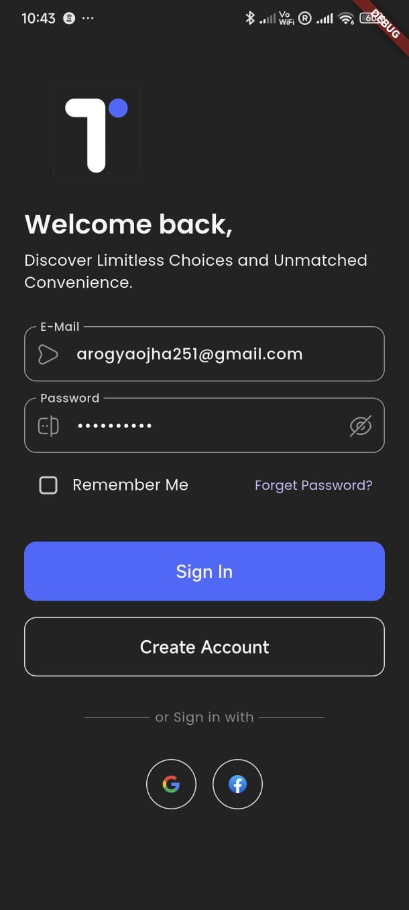
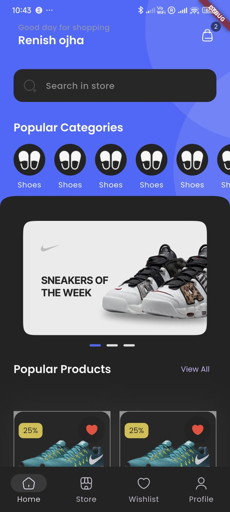

# 🛒 Ecommerce Flutter App

A feature-rich **Flutter Ecommerce App** showcasing sleek UI design, multi-page navigation, and essential ecommerce features like authentication, product browsing, wishlist, and profile management.

> ⚠️ **Note:** Firebase is integrated **only for login, signup, and Google Sign-In**. Other modules function with static or mock data for frontend demonstration purposes.

## 🚀 Features

* 🔗 **Onboarding Screens**

  * Engaging welcome flow for first-time users
* 🔐 **Authentication**

  * Firebase email/password login
  * Google Sign-In integration
* 🛍️ **Home Screen**

  * Product listing in a grid layout
  * Navigation to product details
* 🏣 **Store Page**

  * UI for browsing store-wide collections
* ❤️ **Wishlist Page**

  * Save favorite products for later
* 👤 **Profile Management**

  * View & edit user profile
  * Manage saved addresses
  * View past orders
* ✉️ **Address Page**

  * Add, edit, and manage addresses
* 📦 **My Orders Page**

  * Displays a list of mock order history

## 📱 Screenshots

 Login                             | Home                             |
 --------------------------------- | -------------------------------- |
  |  |

## 🛠️ Tech Stack

* **Flutter** (Frontend UI)
* **Dart** (Programming Language)
* **Firebase Authentication** (Email/Password + Google Sign-In)
* **Material Design**

## 📁 Project Structure

```
lib/
├── main.dart
├── bindings/                     # Dependency injection
├── common/                       # Shared widgets or functions
├── data/                         # API data sources, repositories
├── features/                     # Modular feature-based architecture
│   ├── authentication/
│   │   ├── models/
│   │   └── screens/
│   │       ├── login/
│   │       ├── onboarding/
│   │       ├── password_configuration/
│   │       └── signup/
│   ├── personalization/
│   │   ├── controllers/
│   │   ├── models/
│   │   └── screens/
│   │       ├── address/
│   │       ├── profile/
│   │       └── settings/
│   └── shop/
│       ├── controllers/
│       ├── models/
│       └── screens/
│           ├── all_products/
│           ├── brand/
│           ├── cart/
│           ├── checkout/
│           ├── home/
│           ├── order/
│           ├── product_details/
│           ├── product_reviews/
│           ├── store/
│           └── sub_category/
├── localization/                 # App localization support
├── utils/                        # Utilities and helpers
│   ├── constants/
│   ├── device/
│   ├── exceptions/
│   ├── formatters/
│   ├── helpers/
│   ├── http/
│   ├── loaders/
│   ├── local_storage/
│   ├── logging/
│   ├── popups/
│   └── theme/
```

## 📂 Assets Structure

```
assets/
├── logos/
├── icons/
│   ├── brands/
│   ├── categories/
│   └── payment_methods/
├── images/
│   ├── content/
│   ├── banners/
│   ├── reviews/
│   ├── products/
│   ├── on_boarding_images/
│   └── animations/
└── fonts/
    └── Poppins font family
```

## 💡 How to Run

1. **Clone the Repository**

   ```bash
   git clone https://github.com/aarogyaojha/ecommerce_flutter.git
   cd ecommerce_flutter
   ```

2. **Install Dependencies**

   ```bash
   flutter pub get
   ```

3. **Configure Firebase**

   * Setup a Firebase project
   * Enable **Email/Password Auth** and **Google Sign-In**
   * Download `google-services.json` and add to `android/app/`

4. **Run the App**

   ```bash
   flutter run
   ```

## 📅 Roadmap / Future Enhancements

* 📊 Real backend integration for product and order data
* 💳 Payment gateway integration
* 🔍 Product search and filter functionality
* 📄 Admin dashboard for sellers

## 🤝 Author

**Aarogya Ojha**
[GitHub Profile](https://github.com/aarogyaojha)

## 📄 License

This project is licensed under the [MIT License](LICENSE).

---

> Made with Flutter ❤️
